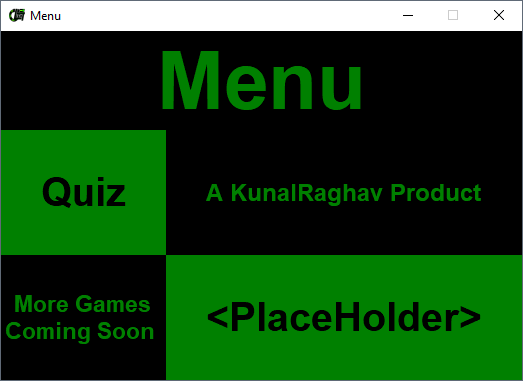

# Python-Quiz

A simple python program that uses tkinter toolkit to create a gui and present some questions in an mcq format.

- requirements: `Python 3`
- modules: `tkinter`, `os`

___

## Other Screenshots:

### Login Screen

### Menu

